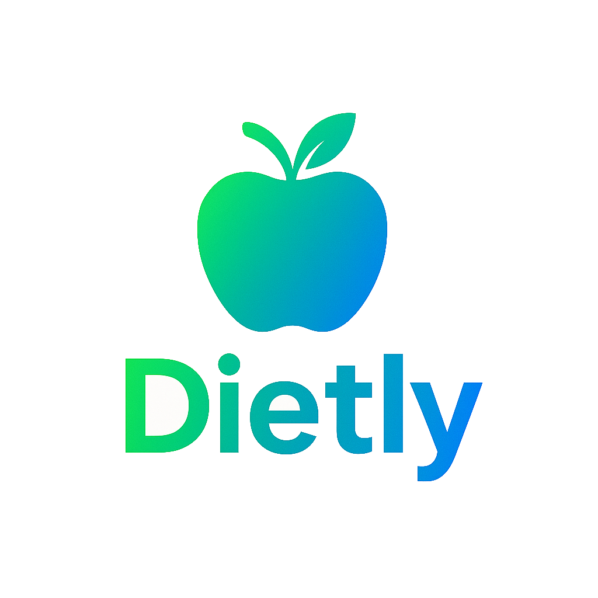
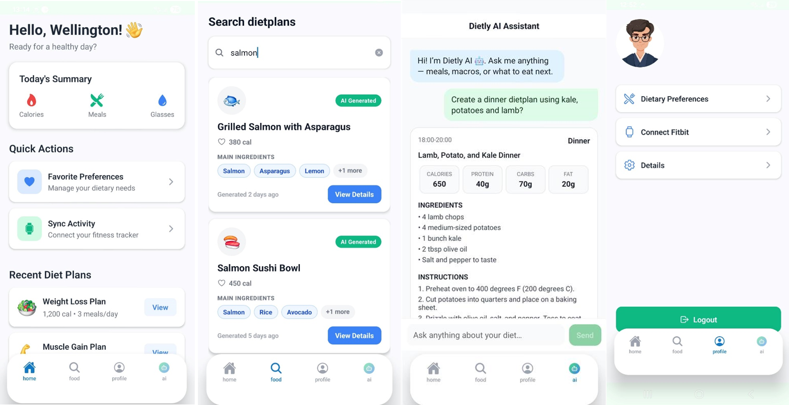
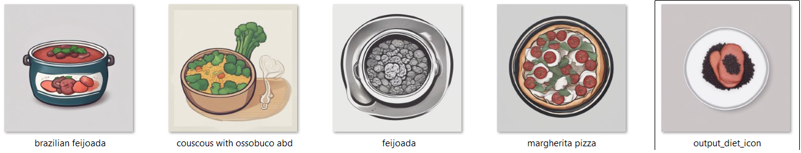
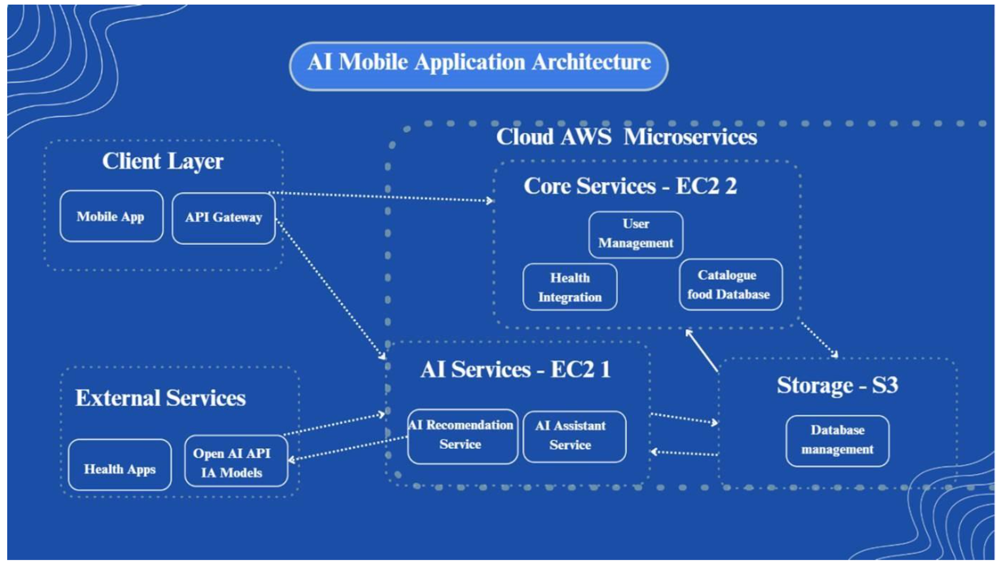

# AI-Planning-D-APP
Testing project

#👨‍💻 About This Project 

This project was developed as part of the Work Integrated Learning at university of Torrens. It present a practical application using a Large Language Model to build-up a personalized diet planning for users. This is a real-world problems and showcases skills in:


<p align='center'>

</p>

<h1 align="center">Dietly - Powerful AI Diet chat Platform</h1>

<p align="center">Dietly is a feature-rich application leveraging DietPlan generated by a local Ollama model with powerful search enhancement and tool calling capabilities to provide health diet plan for any type of meal.</p>


<p align='center'>

</p>


<p align="left">
  
 
  
  
  
  
  
  
  <br><br>
</p>

## Features

- **Meal Image Generation** - Create image icon based on the generate dietplan main protein.
- **Dietplan request** - Generate a simple dietplan for different time of the day
- **Ingridient Description** - Deep analysis of ingridient composition and minerals
- **User avatar personalize** - Personaliza avatar character
- **dieplant catalogue** - Search for existing dietplans
- **diet preferences** - Setting user preferences

## 🤖 Run the AI Service

```bash
cd ai
cd src/api
uvicorn main:app --host 0.0.0.0 --port 8000
```

## 🔧 Run the Backend

```bash
cd backend
npm install
npm run dev
```

## 🔧 Run the Backend/Fitbit

ngrok http 5001

 # This will allow the fitbit to generate the trust link and API to consume the data.


## 📱 Run the Mobile App

```bash
cd mobile
npm install
npm install -g expo-cli
npx expo start
```


# Stable Diffusion for recipe generation icon

Stable Diffusion is a cutting-edge technology that generates image based on given prompt. Dietly utilizes a small lightweight version of SDXL called SDXL-Lightning which is open-source found on Huggingface website. Several modification were implemented so that it could run in a small configured machine parallel to other dietly's services.
 


### Example

`prompt: Professional minimalist flat vector icon of {meal_name}, high-quality 2D graphic, vibrant studio lighting, clean sharp edges, solid white background, centered composition, masterwork, 8k resolution, trending on Dribbble, culinary app style`

<p align='center'>

</p>

<p align='center'>

</p>


# Project Infrastruture - AWS 

Dietly is hosted on AWS using a free-tier plan. The application has several services that are interconnected throught API Services. 

<p align='center'>

</p>
<!-- # Technologies Stack

The project is created with:
*  Python: 3.9
*  TypeScript
*  Javascript
*  Pandas:
*  Scikit-learn:
*  Numpy
*  Nodejs: 22.19.0
*  Npm: 10.9.3
*  npx expo: 54.0.13
*  Ollama: 0.12.0 -->
