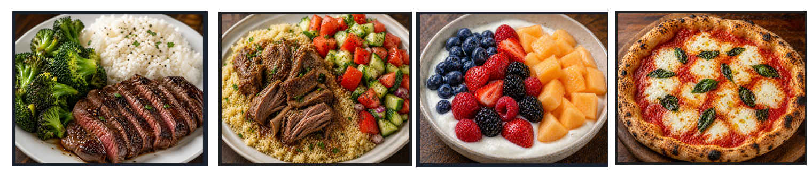

# AI-Planning-D-APP
Testing project

#👨‍💻 About This Project 

This project was developed as part of the Work Integrated Learning at university of Torrens. It present a practical application using a Large Language Model to build-up a personalized diet planning for users. This is a real-world problems and showcases skills in:


<p align='center'>

</p>

<h1 align="center">Dietly - Powerful AI Diet chat Platform</h1>

<p align="center">Dietly is a feature-rich application leveraging DietPlan generated by a local Ollama model with powerful search enhancement and tool calling capabilities to provide health diet plan for any type of meal.</p>


<p align='center'>

</p>


## Features

- **Meal Image Generation** - Create image icon based on the generate dietplan main protein.
- **Dietplan request** - Generate a simple dietplan for different time of the day
- **Ingridient Description** - Deep analysis of ingridient composition and minerals
- **User avatar personalize** - Personaliza avatar character
- **dieplant catalogue** - Search for existing dietplans
- **diet preferences** - Setting user preferences

## 🤖 Run the AI Service

```bash
cd ai
cd src/api
uvicorn main:app --host 0.0.0.0 --port 8000
```

## 🔧 Run the Backend

```bash
cd backend
npm install
npm run dev
```

## 🔧 Run the Backend/Fitbit

ngrok http 5001

 # This will allow the fitbit to generate the trust link and API to consume the data.


## 📱 Run the Mobile App

```bash
cd mobile
npm install
npm install -g expo-cli
npx expo start
```


# Stable Diffusion for recipe generation icon

Stable Diffusion is a cutting-edge technology that generates image based on given prompt. Dietly utilizes a small lightweight version of SDXL called SDXL-Lightning which is open-source found on Huggingface website. Several modification were implemented so that it could run in a small configured machine parallel to other dietly's services.
 


### Example

`prompt: Professional minimalist flat vector icon of {meal_name}, high-quality 2D graphic, vibrant studio lighting, clean sharp edges, solid white background, centered composition, masterwork, 8k resolution, trending on Dribbble, culinary app style`

<p align='center'>

</p>

<p align='center'>

</p>

# Repository Structure


```
├── 📄 .gitattributes (68B)
├── 📄 .gitignore (19B)
├── 📁 ai_pipeline/
│   ├── 📄 .env.example (97B)
│   ├── 📁 datasets/
│   │   ├── 📁 bio/
│   │   │   ├── 📄 calories_2026-04-01.csv (1561.8KB)
│   │   │   ├── 📄 calories_2026-05-01.csv (124.8KB)
│   │   │   ├── 📄 calories_in_heart_rate_zone_2026-04-01.csv (3115.6KB)
│   │   │   ├── 📄 calories_in_heart_rate_zone_2026-05-01.csv (247.7KB)
│   │   │   ├── 📄 calories_in_heart_rate_zone_readme.txt (620B)
│   │   │   ├── 📄 calories_readme.txt (505B)
│   │   │   ├── 📄 distance_2026-04-01.csv (327.7KB)
│   │   │   ├── 📄 distance_2026-05-01.csv (16.7KB)
│   │   │   ├── 📄 distance_readme.txt (506B)
│   │   │   ├── 📄 hydration_log_2026-01-13.csv (119B)
│   │   │   ├── 📄 hydration_log_readme.txt (598B)
│   │   │   ├── 📄 steps_2026-05-01.csv (15.9KB)
│   │   │   └── 📄 steps_readme.txt (504B)
│   │   ├── 📁 dietplans/
│   │   │   ├── 📄 diet_test.csv (34.9KB)
│   │   │   └── 📄 diet_test.json (42.8KB)
│   │   └── 📁 food/
│   │       ├── 📄 daily_food_nutrition_dataset.csv (754.9KB)
│   │       ├── 📄 FOOD-DATA-GROUP1.csv (95.5KB)
│   │       ├── 📄 FOOD-DATA-GROUP2.csv (50.8KB)
│   │       ├── 📄 FOOD-DATA-GROUP3.csv (96.1KB)
│   │       ├── 📄 FOOD-DATA-GROUP4.csv (38.0KB)
│   │       └── 📄 FOOD-DATA-GROUP5.csv (119.0KB)
│   ├── 📄 environment.yml (2.2KB)
│   ├── 📁 image_generator/
│   │   ├── 📄 brazilian feijoada.jpe (576.2KB)
│   │   ├── 📄 brazilian feijoada.png (722.6KB)
│   │   ├── 📄 couscous with ossobuco abd broccoli.jpe (1733.8KB)
│   │   ├── 📄 couscous with ossobuco abd broccoli.png (283.8KB)
│   │   ├── 📄 couscous with ossobuco abd broccoli1.jpe (1411.0KB)
│   │   ├── 📄 couscous with ossobuco abd broccoli1.png (1018.2KB)
│   │   ├── 📄 feijoada.png (1389.5KB)
│   │   ├── 📄 high-quality-sdx.png (1272.8KB)
│   │   ├── 📄 margherita pizza.png (1261.2KB)
│   │   ├── 📄 margherita pizza1.png (1315.7KB)
│   │   ├── 📄 output_diet_icon.png (623.7KB)
│   │   ├── 📄 pizza .png (1370.7KB)
│   │   ├── 📄 pizza calabreza.png (1393.9KB)
│   │   ├── 📄 pizza peperoni.png (315.1KB)
│   │   ├── 📄 pizza.png (1451.8KB)
│   │   ├── 📄 pork ramen .png (1443.1KB)
│   │   ├── 📄 project_test.png (317.3KB)
│   │   ├── 📄 script.py (1.8KB)
│   │   └── 📄 zucchini soup .png (471.2KB)
│   ├── 📁 notebooks/
│   │   ├── 📁 .ipynb_checkpoints/
│   │   │   ├── 📄 EDA-Data-checkpoint.ipynb (121.8KB)
│   │   │   └── 📄 Untitled-checkpoint.ipynb (2.0KB)
│   │   ├── 📄 EDA-Data.ipynb (124.9KB)
│   │   ├── 📄 test.json (991B)
│   │   └── 📄 Untitled.ipynb (3.2KB)
│   ├── 📄 README.md (1.9KB)
│   ├── 📄 requirements.txt (121B)
│   ├── 📄 requirements.yml (2.7KB)
│   ├── 📁 src/
│   │   ├── 📁 api/
│   │   │   ├── 📄 main.py (14.8KB)
│   │   │   ├── 📁 routers/
│   │   │   │   ├── 📄 generate.py (0B)
│   │   │   │   └── 📄 health.py (169B)
│   │   ├── 📄 config.py (500B)
│   │   └── 📁 models/
│   │       ├── 📁 adapters/
│   │       │   └── 📄 generate.ts (625B)
│   │       ├── 📄 ollama_client.py (0B)
│   │       ├── 📄 package-lock.json (831B)
│   │       └── 📄 package.json (56B)
│   └── 📁 testing/
│       ├── 📄 chat_01.txt (1.4KB)
│       ├── 📄 chat_02.txt (488B)
│       ├── 📄 chat_03.txt (1.7KB)
│       ├── 📄 history_chat.txt (547B)
│       ├── 📄 model-main.py (1.0KB)
│       ├── 📄 model_response.txt (2.0KB)
│       ├── 📄 recipe-gen.json (1.7KB)
│       ├── 📄 test-main.py (1.1KB)
│       └── 📄 test-model.py (1.4KB)
├── 📁 backend/
│   ├── 📄 .gitignore (20B)
│   ├── 📄 drizzle.config.js (351B)
│   ├── 📁 fitbit/
│   │   ├── 📄 data-analysis.py (486B)
│   │   └── 📄 router.js (15.6KB)
│   ├── 📄 package-lock.json (100.1KB)
│   ├── 📄 package.json (630B)
│   ├── 📄 README.md (2.7KB)
│   └── 📁 src/
│       ├── 📁 config/
│       │   ├── 📄 cron.js (542B)
│       │   ├── 📄 db.js (334B)
│       │   └── 📄 env.js (214B)
│       ├── 📁 db/
│       │   ├── 📁 migrations/
│       │   │   ├── 📄 0000_remarkable_sunset_bain.sql (246B)
│       │   │   ├── 📄 0001_clumsy_tyrannus.sql (241B)
│       │   │   ├── 📄 0001_glossy_masked_marvel.sql (244B)
│       │   │   ├── 📄 0001_little_rage.sql (241B)
│       │   │   ├── 📄 0002_loose_nomad.sql (29B)
│       │   │   ├── 📄 0002_testTable.sql (26B)
│       │   │   ├── 📄 0003_cool_dazzler.sql (241B)
│       │   │   ├── 📄 0003_next_songbird.sql (241B)
│       │   │   ├── 📄 0004_testTable.sql (26B)
│       │   │   ├── 📄 0005_lowly_black_crow.sql (241B)
│       │   │   ├── 📄 0006_testTable.sql (26B)
│       │   │   ├── 📄 0007_great_mysterio.sql (241B)
│       │   │   ├── 📄 0008_testTable.sql (26B)
│       │   │   ├── 📄 0009_productive_wolverine.sql (241B)
│       │   │   ├── 📄 0010_testTable.sql (26B)
│       │   │   ├── 📄 0011_slimy_paper_doll.sql (241B)
│       │   │   ├── 📄 0012_eager_robbie_robertson.sql (26B)
│       │   │   ├── 📄 0013_shocking_famine.sql (285B)
│       │   │   ├── 📄 0014_normal_the_leader.sql (62B)
│       │   │   ├── 📄 0015_jazzy_power_man.sql (1.2KB)
│       │   │   ├── 📄 0016_classy_nitro.sql (4.4KB)
│       │   │   ├── 📄 0017_neat_molly_hayes.sql (5.6KB)
│       │   │   ├── 📄 0018_little_surge.sql (1.3KB)
│       │   │   └── 📁 meta/
│       │   │       ├── 📄 0000_snapshot.json (1.9KB)
│       │   │       ├── 📄 0001_snapshot.json (3.4KB)
│       │   │       ├── 📄 0002_snapshot.json (1.9KB)
│       │   │       ├── 📄 0009_snapshot.json (3.4KB)
│       │   │       ├── 📄 0010_snapshot.json (1.9KB)
│       │   │       ├── 📄 0011_snapshot.json (3.4KB)
│       │   │       ├── 📄 0012_snapshot.json (1.9KB)
│       │   │       ├── 📄 0013_snapshot.json (3.5KB)
│       │   │       ├── 📄 0014_snapshot.json (3.7KB)
│       │   │       ├── 📄 0015_snapshot.json (8.7KB)
│       │   │       ├── 📄 0016_snapshot.json (19.1KB)
│       │   │       ├── 📄 0017_snapshot.json (35.3KB)
│       │   │       ├── 📄 0018_snapshot.json (31.9KB)
│       │   │       └── 📄 _journal.json (2.8KB)
│       │   └── 📄 schema.js (7.4KB)
│       └── 📄 server.js (4.7KB)
├── 📁 mobile/
│   ├── 📁 .cursor/
│   │   └── 📄 mcp.json (206B)
│   ├── 📄 .gitignore (502B)
│   ├── 📁 app/
│   │   ├── 📁 (auth)/
│   │   │   ├── 📄 sign-in.jsx (6.2KB)
│   │   │   ├── 📄 sign-up.jsx (7.0KB)
│   │   │   ├── 📄 verify-email.jsx (4.8KB)
│   │   │   └── 📄 _layout.tsx (491B)
│   │   ├── 📁 (tabs)/
│   │   │   ├── 📄 ai_assistant.jsx (9.7KB)
│   │   │   ├── 📄 dietplan_search.jsx (4.1KB)
│   │   │   ├── 📄 home_screen.jsx (7.9KB)
│   │   │   ├── 📄 user_profile.jsx (5.7KB)
│   │   │   └── 📄 _layout.jsx (3.3KB)
│   │   ├── 📁 ai_settings/
│   │   │   ├── 📄 brief_dietplanCard.jsx (5.1KB)
│   │   │   ├── 📄 chat.jsx (305B)
│   │   │   └── 📄 full_dietplanCard.jsx (8.1KB)
│   │   ├── 📄 extra_recipes.jsx (280B)
│   │   ├── 📄 get-started.jsx (1.4KB)
│   │   ├── 📄 index.jsx (2.2KB)
│   │   ├── 📄 personalysed.jsx (277B)
│   │   ├── 📁 screens/
│   │   │   └── 📄 daily_meal.jsx (271B)
│   │   ├── 📁 testing/
│   │   │   ├── 📄 arvy.jsx (264B)
│   │   │   ├── 📄 Shalini.jsx (268B)
│   │   │   ├── 📄 shameem.jsx (269B)
│   │   │   └── 📄 wellington.jsx (276B)
│   │   ├── 📁 user_settings/
│   │   │   ├── 📄 account.jsx (316B)
│   │   │   ├── 📄 details.jsx (6.8KB)
│   │   │   ├── 📄 favorites.jsx (2.5KB)
│   │   │   ├── 📄 fitbit.jsx (4.4KB)
│   │   │   ├── 📄 preferences.jsx (8.3KB)
│   │   │   └── 📄 settings.jsx (321B)
│   │   └── 📄 _layout.tsx (2.0KB)
│   ├── 📄 app.json (1.3KB)
│   ├── 📁 assets/
│   │   ├── 📁 fonts/
│   │   │   ├── 📄 Montserrat-Bold.ttf (193.4KB)
│   │   │   ├── 📄 Montserrat-Light.ttf (193.4KB)
│   │   │   ├── 📄 Montserrat-Medium.ttf (193.5KB)
│   │   │   ├── 📄 Montserrat-Regular.ttf (193.3KB)
│   │   │   ├── 📄 Montserrat-SemiBold.ttf (193.6KB)
│   │   │   ├── 📄 Poppins-Bold.ttf (146.8KB)
│   │   │   ├── 📄 Poppins-Light.ttf (152.5KB)
│   │   │   ├── 📄 Poppins-Medium.ttf (149.3KB)
│   │   │   ├── 📄 Poppins-Regular.ttf (151.0KB)
│   │   │   ├── 📄 Poppins-SemiBold.ttf (148.0KB)
│   │   │   └── 📄 ShorelinesScriptBold.otf (40.4KB)
│   │   ├── 📁 images/
│   │   │   ├── 📄 ai-icon-v1.png (4.0KB)
│   │   │   ├── 📄 ai-icon.png (5.3KB)
│   │   │   ├── 📄 ai-icon1.png (1.6KB)
│   │   │   ├── 📄 android-icon-background.png (17.1KB)
│   │   │   ├── 📄 android-icon-foreground.png (76.9KB)
│   │   │   ├── 📄 android-icon-monochrome.png (4.0KB)
│   │   │   ├── 📄 Application-Architecture-Cloud.png (1000.6KB)
│   │   │   ├── 📄 ChatGPT Image Oct 4, 2025, 11_25_21 AM.png (1383.3KB)
│   │   │   ├── 📄 Dietly-bg.png (3272.6KB)
│   │   │   ├── 📄 dietly-logo-v2.png (302.2KB)
│   │   │   ├── 📄 dietly-logo.png (1193.7KB)
│   │   │   ├── 📄 dietly.png (605.3KB)
│   │   │   ├── 📄 Dietly_logo_white.png (12.0KB)
│   │   │   ├── 📄 favicon.png (1.1KB)
│   │   │   ├── 📄 high-quality-sdx.png (1272.8KB)
│   │   │   ├── 📄 icon.png (384.3KB)
│   │   │   ├── 📄 partial-react-logo.png (5.0KB)
│   │   │   ├── 📄 react-logo.png (6.2KB)
│   │   │   ├── 📄 react-logo@2x.png (13.9KB)
│   │   │   ├── 📄 react-logo@3x.png (20.8KB)
│   │   │   ├── 📄 s1.png (82.8KB)
│   │   │   ├── 📄 s2.png (63.9KB)
│   │   │   ├── 📄 s3.png (82.0KB)
│   │   │   ├── 📄 salad_7694022.png (43.3KB)
│   │   │   └── 📄 splash-icon.png (17.1KB)
│   │   └── 📁 styles/
│   │       ├── 📄 auth.styles.js (1.9KB)
│   │       ├── 📄 base.js (653B)
│   │       ├── 📄 favorites.styles.js (2.5KB)
│   │       ├── 📄 home.styles.js (5.2KB)
│   │       ├── 📄 recipe-details.styles.js (7.3KB)
│   │       └── 📄 search.styles.js (2.6KB)
│   ├── 📁 components/
│   │   └── 📄 SafeScreen.jsx (594B)
│   ├── 📁 constants/
│   │   └── 📄 colors.js (3.2KB)
│   ├── 📄 eslint.config.js (247B)
│   ├── 📄 expo-env.d.ts (110B)
│   ├── 📄 package-lock.json (524.7KB)
│   ├── 📄 package.json (1.5KB)
│   ├── 📄 README.md (1.7KB)
│   ├── 📁 services/
│   │   └── 📄 mealAPI.js (728B)
│   └── 📄 tsconfig.json (259B)
├── 📄 package-lock.json (314.9KB)
├── 📄 package.json (56B)
├── 📄 project-map.txt (18.1KB)
├── 📄 project-mapper.js (5.5KB)
└── 📄 README.md (3.2KB)
```

# Project Infrastruture - AWS 

Dietly is hosted on AWS using a free-tier plan. The application has several services that are interconnected throught API Services. 

<p align='center'>

</p>
<!-- # Technologies Stack

The project is created with:
*  Python: 3.9
*  TypeScript
*  Javascript
*  Pandas:
*  Scikit-learn:
*  Numpy
*  Nodejs: 22.19.0
*  Npm: 10.9.3
*  npx expo: 54.0.13
*  Ollama: 0.12.0 -->
